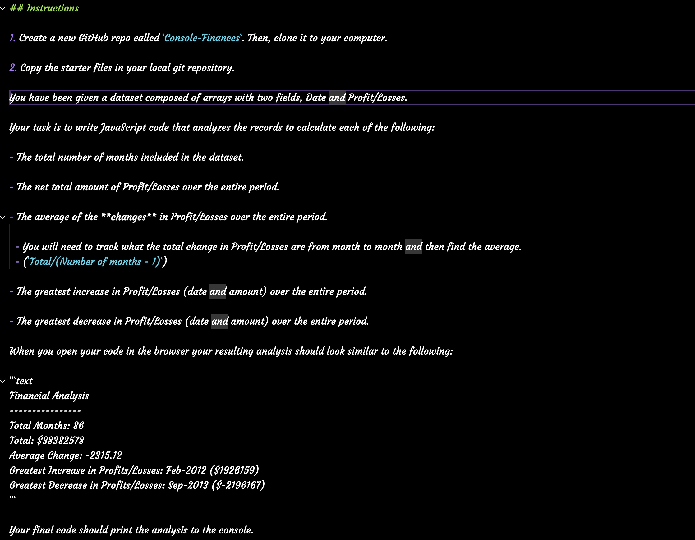

# Console-Finances

## Description

In this week's challenge :star_struck:, we were given a real-world situation to implement the new JavaScript skills we learnt. We were tasked with creating code for analyzing the financial records of a company. We were provided with a financial dataset.

Below is a screenshot of the data.
 
 

## Usage

The purpose of the code created is to analyse the financial records of a company. In the screenshot above, you can view the intructions for the data analysis. Below is a link to the JavaScript code.

http://127.0.0.1:5501/index.html

## License

Licensed under the MIT license.
